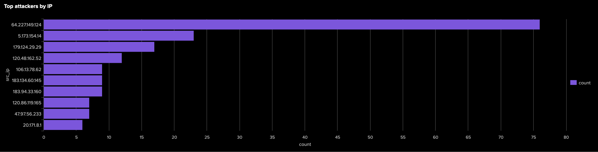
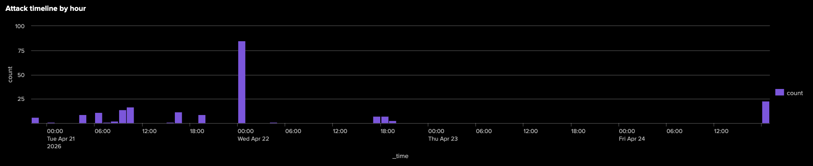
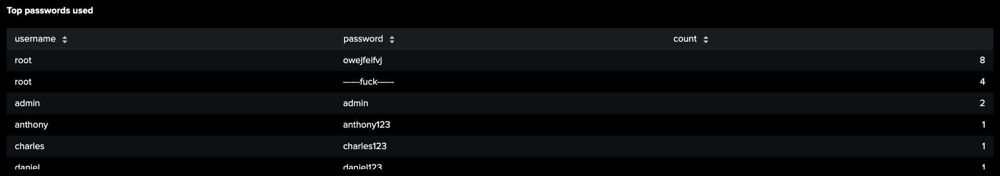
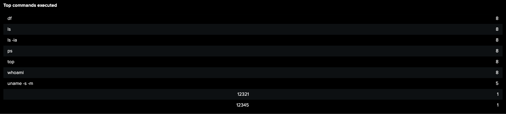
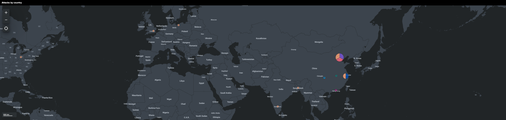
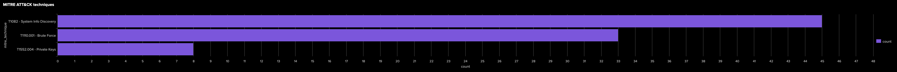

# Threat Detection Platform

A SOC home lab that collects real-world attack data from a public-facing honeypot, ingests logs into Splunk SIEM, and triggers real-time Discord alerts.

## Live Results

**7 days of data collected:**
- 20+ unique attackers from 8 countries
- 500+ events indexed in Splunk
- Top attacking countries: India (76), China (69), Brazil (17), USA (16)
- Most common technique: T1082 System Information Discovery

## Architecture
Internet (real attackers)
↓ port 2222
AWS EC2 t2.micro — Cowrie SSH Honeypot (Docker)
↓ Tailscale VPN (ACL: honeypot → Splunk:8088 only)
↓ HEC — every 1 minute via cron
Splunk Enterprise (Windows)
↓
Alerts (Discord) + Cowrie Dashboard
## Dashboard

### Top attackers by IP


### Attack timeline by hour


### Top passwords used by attackers


### Top commands executed after login


### Geo map — attack origins


### MITRE ATT&CK techniques detected


## Tech Stack

| Category | Technology |
|----------|-----------|
| Cloud | AWS (EC2, S3, IAM, VPC) |
| IaC | Terraform |
| Honeypot | Cowrie SSH (Docker) |
| SIEM | Splunk Enterprise |
| VPN | Tailscale (ACL protected) |
| Alerting | Discord webhooks |
| OS | Ubuntu 22.04 |

## Detection Rules

| Alert | Threshold | Severity |
|-------|-----------|----------|
| SSH Brute Force | >10 attempts/min | Critical |
| Web Scanner | >100 requests/min | High |
| 404 Brute Force | >50 errors/min | High |

## MITRE ATT&CK Coverage

| Technique | ID | Events |
|-----------|-----|--------|
| System Information Discovery | T1082 | 45+ |
| Brute Force: Password Guessing | T1110.001 | 15+ |
| Unsecured Credentials: Private Keys | T1552.004 | 8+ |
| Valid Accounts: Default Credentials | T1078.001 | 3+ |

## Real Attacks Detected

| Country | Events | Notes |
|---------|--------|-------|
| India | 76 | Digital Ocean VPS - automated scanner |
| China | 69 | Multiple IPs - botnet activity |
| Brazil | 17 | Confirmed malicious - 15/95 VirusTotal |
| United States | 16 | Azure/AWS cloud scanners |
| Bangladesh | 6 | IoT botnet |
| United Kingdom | 3 | Cloud scanner |
| Singapore | 2 | Asian botnet node |
| Australia | 1 | Single scan attempt |

## Top Passwords Attempted

| Username | Password | Notes |
|----------|----------|-------|
| root | owejfeifvj | Random string - automated |
| root | ------fuck------ | Aggressive scanner |
| admin | admin | Default credentials |
| orangepi | orangepi | IoT device targeting |

## Security Hardening

- Tailscale ACL: EC2 sees ONLY Splunk port 8088
- Docker: `--read-only`, `--security-opt no-new-privileges`
- UFW firewall: only ports 22, 2222, 41641 open
- SSH: password auth disabled, root login disabled
- sudo: requires password (NOPASSWD removed)
- Tailscale state: chmod 600 + chattr +i
- Lynis hardening score: 59/100

## Project Structure
├── terraform/          # AWS infrastructure as code
├── splunk/
│   ├── searches/       # SPL detection queries
│   └── dashboards/     # Dashboard JSON definitions
├── scripts/            # Automation scripts
├── playbooks/          # Incident response procedures
└── docs/screenshots/   # Evidence screenshots

## Setup

```bash
cd terraform
terraform init
terraform apply -var="your_ip=$(curl -s ifconfig.me)/32"
```

## Roadmap

- [x] Week 1: Honeypot infrastructure + Splunk integration
- [x] Week 2: Cowrie dashboard + MITRE ATT&CK mapping + Security hardening
- [ ] Week 3: IR Playbooks + CloudTrail integration
- [ ] Week 4: AbuseIPDB reporting + Prometheus monitoring
